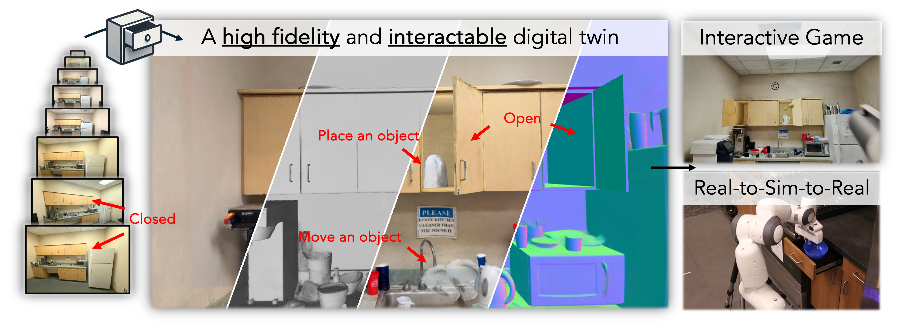

<h1> DRAWER: Digital Reconstruction and Articulation With Environment Realism</h1>

<a href="https://xiahongchi.github.io">Hongchi Xia1</a>,
<a href="https://entongsu.github.io/">Entong Su2</a>,
<a href="https://memmelma.github.io/">Marius Memmel2</a>,
<a href="https://arhanjain.github.io/">Arhan Jain2</a>,
<a href="https://raymondyu5.github.io/">Raymond Yu2</a>,
<a href="https://www.linkedin.com/in/numfor-mbiziwo-tiapo/">Numfor Mbiziwo-Tiapo2</a>,
 
<a href="https://homes.cs.washington.edu/~ali/">Ali Farhadi2,3</a>,
<a href="https://homes.cs.washington.edu/~abhgupta/">Abhishek Gupta2</a>,
<a href="https://shenlong.web.illinois.edu/">Shenlong Wang1</a>,
<a href="https://www.cs.cornell.edu/~weichiu/">Wei-Chiu Ma4</a>

 

1University of Illinois Urbana-Champaign, 
2University of Washington,
3Allen Institute for AI,
4Cornell University

 

CVPR 2025

## Environment
Our code repo needs to setup three environments.

1. For SDF Reconstruction, please follow the instructions [Here](sdf/env.sh).

2. For Gaussian Splat Reconstruction, please follow the instructions [Here](splat/env.sh).

3. For Isaac Sim, please follow the instructions [Here](isaac_sim/env.sh).

## Data

* We provide the data we collected in UIUC and UW, which can be downloaded from [Here](scripts/data.sh).

* We provide our door tracking evaluation data [Here](https://huggingface.co/datasets/hongchi/DRAWER/resolve/main/tracks.zip).

## Checkpoints
We provide the download links of checkpoints of foundation models we used [Here](scripts/ckpt.sh).

## Usage
DRAWER is a system with multiple stages. We provide a guidance for the usage of our code stage-by-stage ([SDF Reconstruction](scripts/run_stage1_sdf.sh), [3D Based Perception](scripts/run_stage2_perception.sh), [Isaac Sim Simulation](scripts/run_stage3_isaacsim.sh), and [Gaussian Splat Reconstruction](scripts/run_stage4_gsplat.sh)) and the whole system altogether [Here](scripts/run_system.sh).

We also provide the scripts for the usage of our dual representation reconstruction. Please directly check [Here](scripts/dual_recon.sh).

For the whole system usage, here is a brief explanation:

**Stage 1**: [SDF Reconstruction](scripts/run_stage1_sdf.sh):

* Use [diffusion-e2e-ft](https://github.com/VisualComputingInstitute/diffusion-e2e-ft) to generate monocular normal and depth priors.

* Use an improved version of BakedSDF based on [SDFStudio](https://github.com/autonomousvision/sdfstudio) to run sdf reconstruction.

**Stage 2**: [3D Based Perception](scripts/run_stage2_perception.sh):

* Use [Grounded SAM](https://github.com/IDEA-Research/Grounded-Segment-Anything) to recognize drawers and cabinet doors in the scene.

* Use graph based method and GPT-4o to filter and finalize the 2d locations of doors. (<u>We suggest double checking with the perception results, since it's not perfect and could lead to failure cases, and please refer to note [Here](scripts/run_stage2_perception.sh#L71).</u>)

* Use [3DOI](https://github.com/JasonQSY/3DOI) to infer the articulation information.

* Fit drawer and cabinet doors to correct 3d location.

**Stage 3**: [Isaac Sim Simulation](scripts/run_stage3_isaacsim.sh):

* Transform the scene into USD file format.

* Simulate the scene dynamics and attain the trajectory of doors.

**Stage 4**: [Gaussian Splat Reconstruction](scripts/run_stage4_gsplat.sh):

* Run our Gaussian on Mesh reconstruction developed based on [NeRFStudio](https://github.com/nerfstudio-project/nerfstudio).

* Use [Matfuse](https://github.com/giuvecchio/matfuse-sd) to generate textures.

* Merge Gaussian Splats of the scene and the cabinets.

## Applications
DRAWER has applications including:

* Use scripts [Here](splat/scripts/splat_export.py) to export Gaussians of the scene and each doors, which could be loaded into [Unreal Engine](https://www.unrealengine.com/en-US/unreal-engine-5) with [Lama AI Plugin](https://lumaai.notion.site/Luma-Unreal-Engine-Plugin-0-41-8005919d93444c008982346185e933a1).

* Real-to-Sim-to-Real Training: Please use the scripts [Here](isaac_sim/robotic.sh) to generate usd file for isaac lab and refer to the code [Here](https://github.com/Entongsu/DRAWER-Real2Sim2Real).

## Progress
- [x] SDF Reconstruction
- [x] Perception
- [x] Isaac Sim Simulation
- [x] Gaussian Splat on Mesh
- [x] Data Release
- [x] Real-to-Sim-to-Real Training

## Contact
Contact [Hongchi Xia](mailto:hongchix@illinois.edu) if you have any further questions. 

## Acknowledgments
Our codebase builds heavily on [SDFStudio](https://github.com/autonomousvision/sdfstudio), [NeRFStudio](https://github.com/nerfstudio-project/nerfstudio), [diffusion-e2e-ft](https://github.com/VisualComputingInstitute/diffusion-e2e-ft), [Grounded SAM](https://github.com/IDEA-Research/Grounded-Segment-Anything), [3DOI](https://github.com/JasonQSY/3DOI), and [Matfuse](https://github.com/giuvecchio/matfuse-sd). Thanks for open-sourcing!

